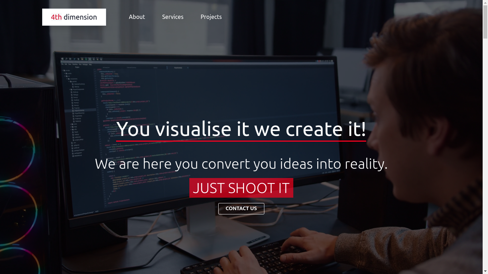

# 4th-dimension

### Who took part in the development:

Sushanta: https://github.com/mesushanta

Bilal: https://github.com/NewDev58

Sofiane: https://github.com/makhouts

Maga: https://github.com/MagaSu

### Why we maked this project?:
People who want a website for themselves or their business can find us and easily order a quality project from us...

If you need a quality website, do not hesitate to contact us:
https://mesushanta.github.io/4th-dimension/index.html

### For developers (GO AWAY IF YOU ARE NOT A DEVELOPER): 

Our site is maked with css framework - Bootstrap 5.

Screenshot of the project:

.
░░░░░░░░░░░▄▄▄▄▄▄▄▄▄▄██▄▄▄▄▄▄▄▄▄░░░░▄░
▄███████████████████████▀▀▀▀▀▀▀██████▀  ☣️ ☣️ ☣️ ☣️ ☣️ ☣️ ☣️ ☣️ ☣️
██████▀▀▀░▄██▀░░▀███░░░░░░░░░░░░░░░░░░
▀▀▀▀░░░░░░██░░░░░▀██▄░░░░░░░░░░░░░░░░░
░░░░░░░░░░░░░░░░░░▀███▄░░░░░░░░░░░░░░░
░░░░░░░░░░░░░░░░░░░░▀▀░░░░░░░░░░░░░░░░
